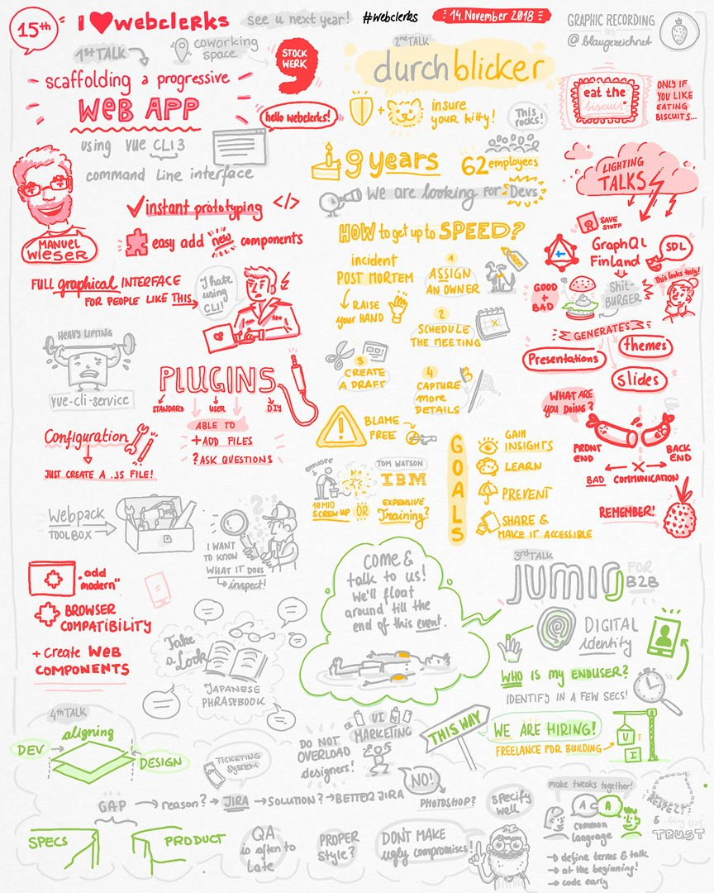

# webclerks Meetup #15 November 14th 2018

Sketchnotes by <https://twitter.com/CptBlaubeere>

## Scaffolding a Progressive Web App using Vue CLI 3

by [Manuel Wieser](https://twitter.com/manuelwieser)

### Slides

<https://speakerdeck.com/lorti/scaffolding-a-progressive-web-app-using-vue-cli-3-webclerks>

## Aligning Development & Design

by [Björn Ganslandt](https://twitter.com/Ansimorph)

### Slides

<https://aligning.netlify.com/>
